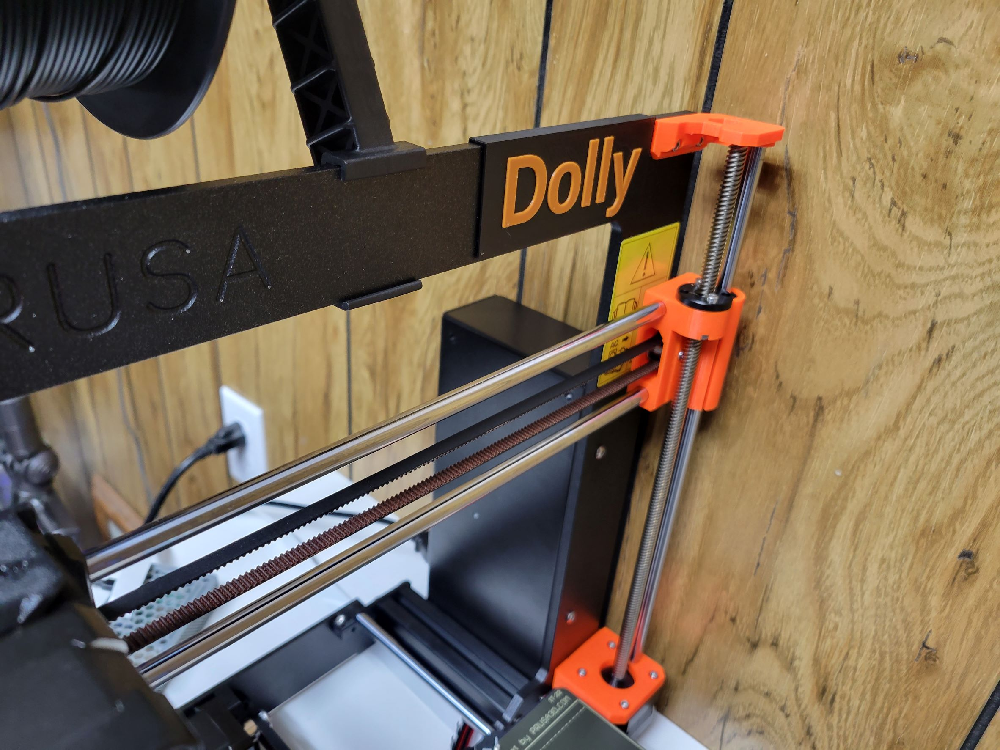
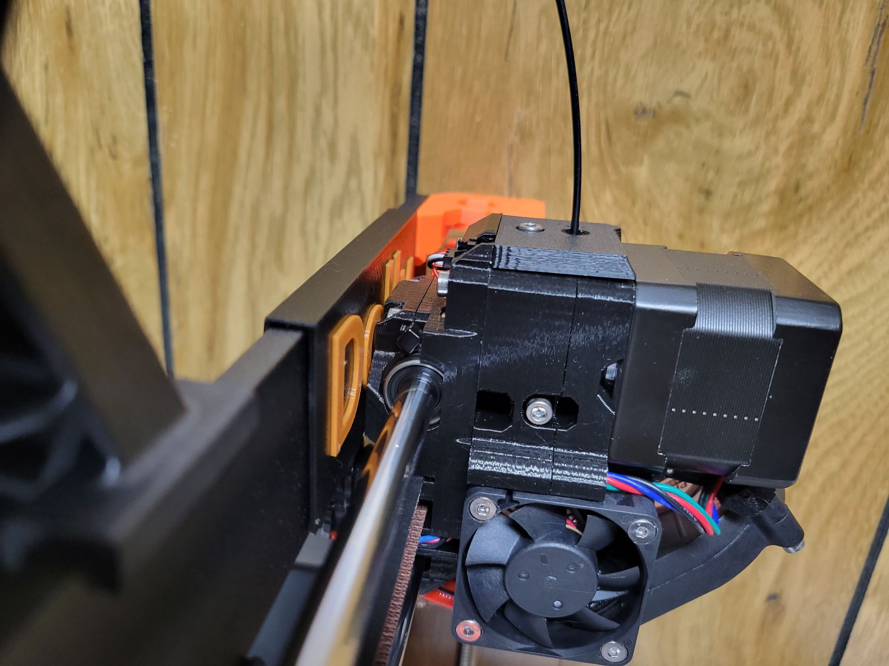
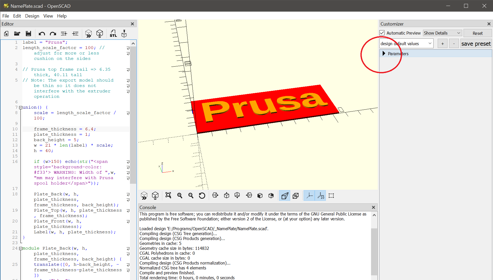
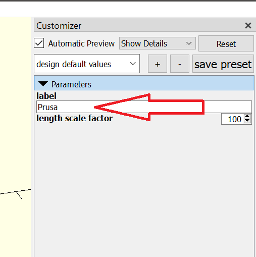
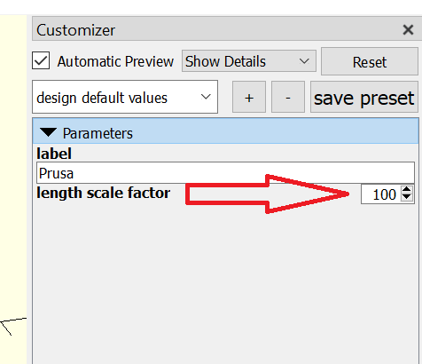
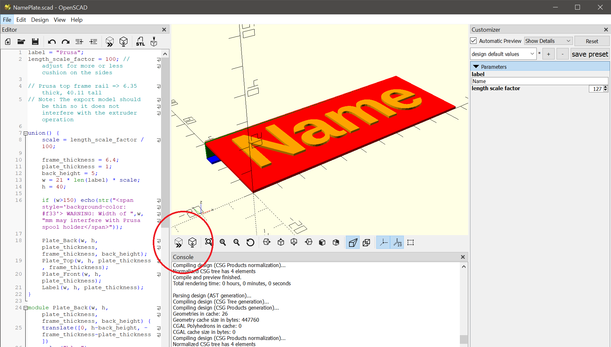
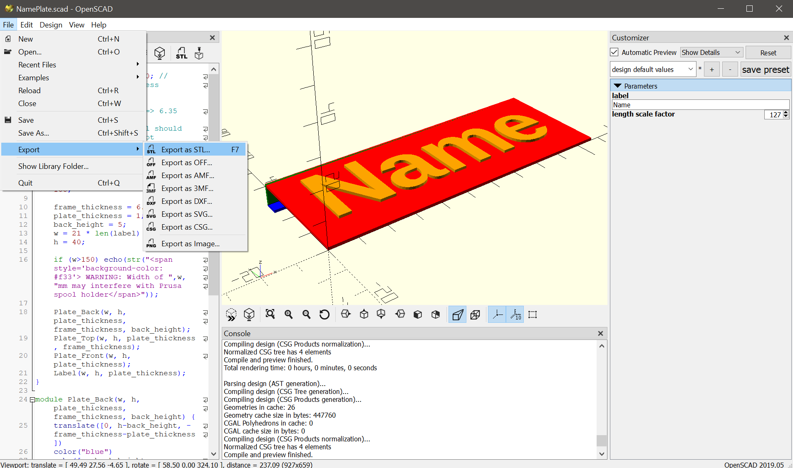

# Prusa NamePlate Generator
This is a simple program that will generate a name plate that will hook over the top of the frame of several Prusa i3 models. It should fit the MK3, MK3S, and MK3S+ without issue. 

It is possible that it will fit (with the default values contained in this program) models other than those listed above, as long as they have a gantry thickness of 6.35mm.

---

The generated plate is intentionally thin to maintain clearance for the extruder head at the top of the Z axis. Additionally, the plate is unsecured at the bottom so that if a collision does occur, hopefully the plate will pop off before breaking something :)

## Use
This program relies on the OpenSCAD software located [here](https://openscad.org/downloads.html) in order to operate. It was generated using version 2019.05, your mileage with other versions may vary.

---

After opening the program, clicking the parameters dropdown menu will display the variables needed to generate the plate.

---

This option will change the text contained generated on the nameplate.

---

Unfortunately, there is no method (at least that I know) of capturing the generated text width, so the text is centered and the width of the backing plate is estimated. This variable allows for width adjustment of the plate underneath the text so that it will fit properly.

---

The button on the left will generate a quick preview of the model, and the button on the right will perform a full render.

---

Finally, the menu option hightlighted in this image will generate the .STL file for use in your slicer. Instructions located [here](https://help.prusa3d.com/article/color-change_1687) can be used to get the different colors as seen in the image at the top of this page. Happy printing!